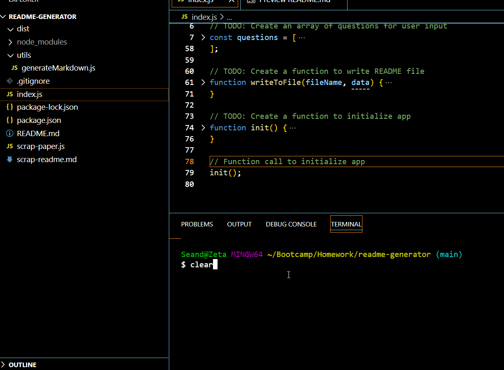

# readme-generator

## Description
This JavaScript file will generate a README.md file based on user input gathered from inquirer.
## Usage
This program should be used to create a unique README.md file for any project.
## Visual
;
## Contributors
Sean Duiser
sean.duiser.develop@gmail.com
## License
MIT